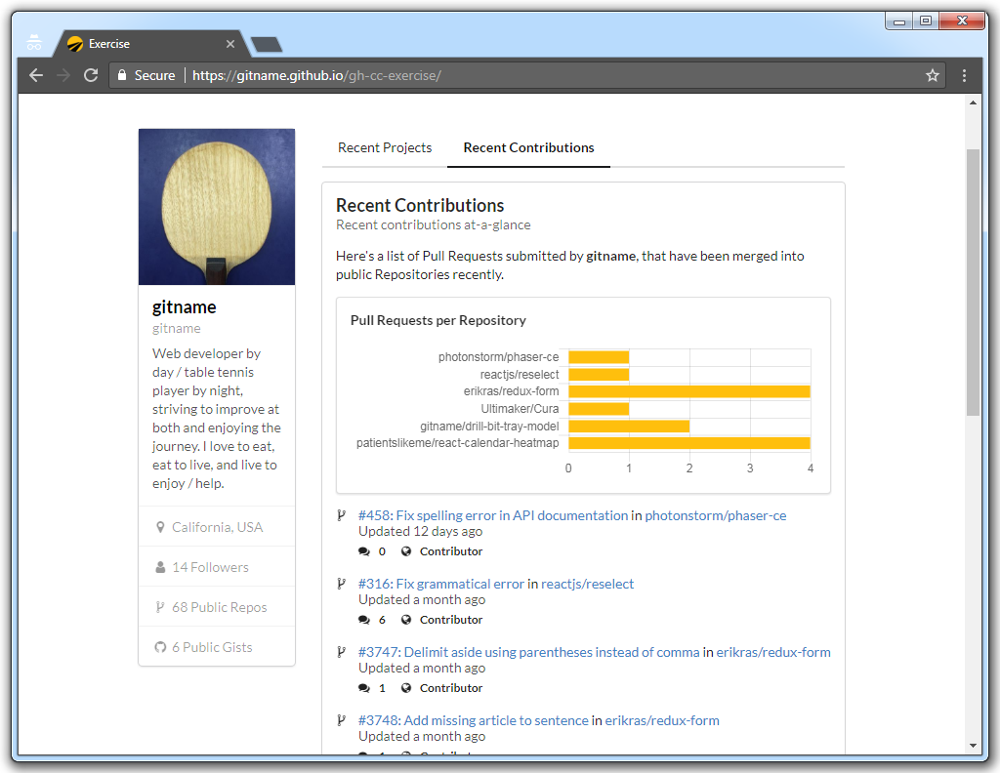

# GH CC Exercise

## Introduction

GH CC Exercise is a web app that displays information about a GitHub user. It was originally developed over a holiday weekend as an exercise in using [`cc-react-scripts`](github.com/clearcapital/cc-react-scripts) and the GitHub REST API v3.

## Screenshot

## Technologies

GH CC Exercise was built using the following technologies:

* React (via [`create-react-app`](https://github.com/facebookincubator/create-react-app))
* [`cc-react-scripts`](github.com/clearcapital/cc-react-scripts)
* Redux
* Redux Thunk
* [`babel-plugin-react-css-modules`](https://github.com/gajus/babel-plugin-react-css-modules)
* Semantic UI
* Chart.js (via [`react-chartjs-2`](https://github.com/jerairrest/react-chartjs-2))
* Fetch API
* [GitHub REST API v3](https://developer.github.com/v3/)
* ECMAScript 2015/ES6

## Features

GH CC Exercise has the following features:

* **Interactive Charts**: When the visitor hovers over a data point in a chart, the chart displays a tooltip containing information about that data point    
* **Loading Indicator**: While the web application fetches data from the internet, it displays a loading animation
* **Responsive Layout**: The layout of the page automatically adjusts itself to accommodate screens of various widths (e.g. desktop and mobile) 
* **REST API Utilization**: The web application retrieves data from GitHub via the GitHub REST API v3

## Limitations

GH CC Exercise has the following limitation:

* **Limited Data Retrieval**: When the web application fetches data from GitHub, it only fetches the first page of results. Generally, that means only _the most recent_ repositories, pull requests, etc. are reflected in the web application's user interface. This limitation is accounted for in the text on the user interface, in its regular employment of the word, "recent."
* **Hits GitHub's REST API Rate Limit**: GitHub limits the number of times a computer can access its REST API during a given time period. It is possible—by reloading the page multiple times in rapid succession, for example—to cause this web application to hit that limit on behalf of a visitor's computer. When that happens, the web application will display generic error information on the page. Visitors can recover from that error by refraining from using the web application—and from otherwise accessing the GitHub REST API—for several minutes (e.g. 20 minutes).
    
## Demo

You can explore a live version of GH CC Exercise at the following URL:

https://gitname.github.io/gh-cc-exercise